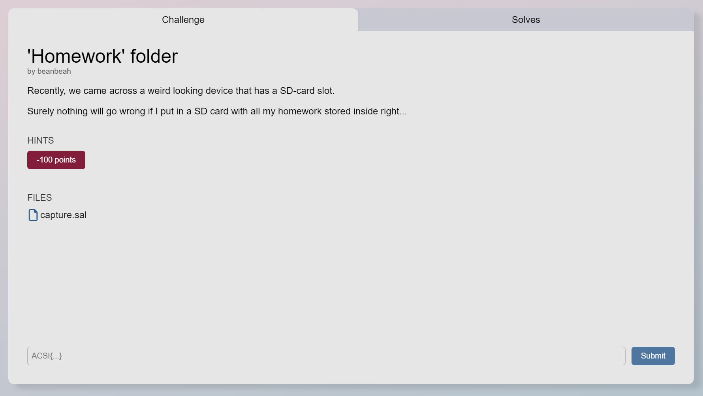
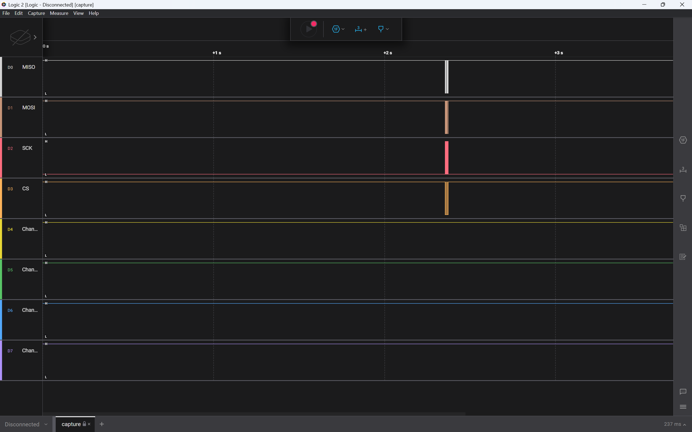
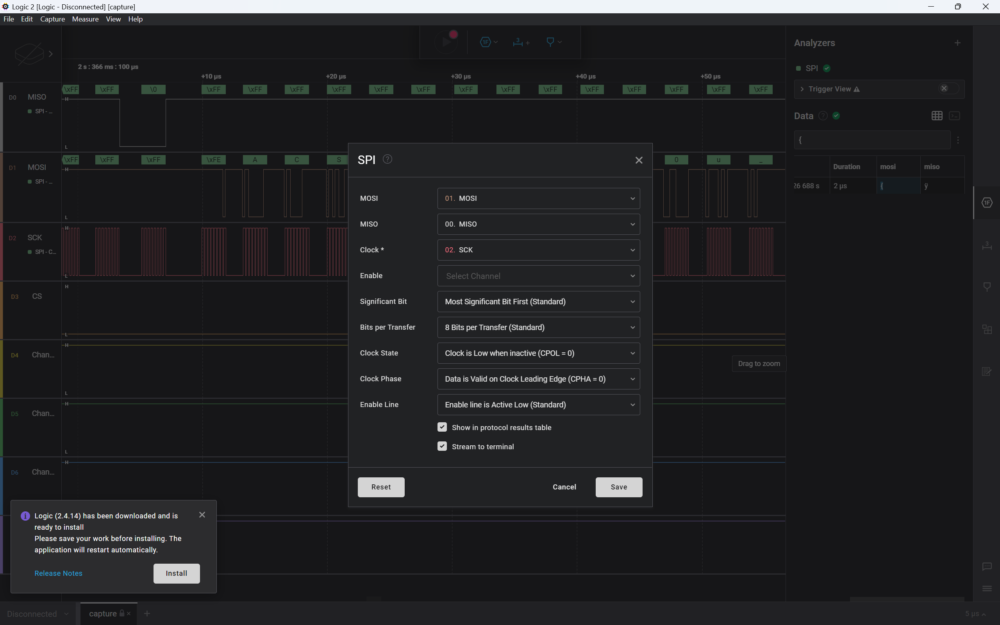
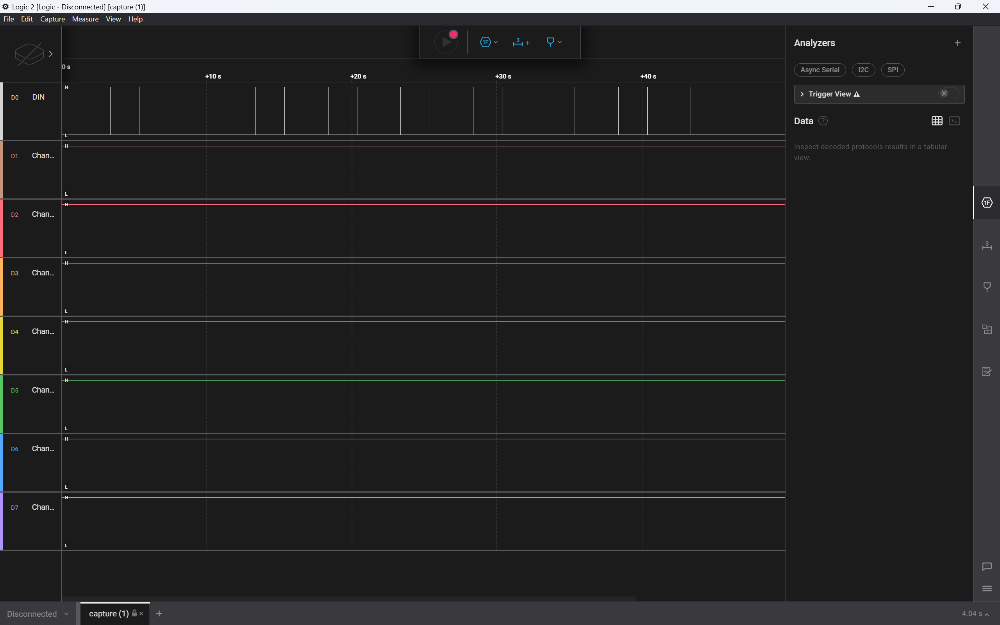
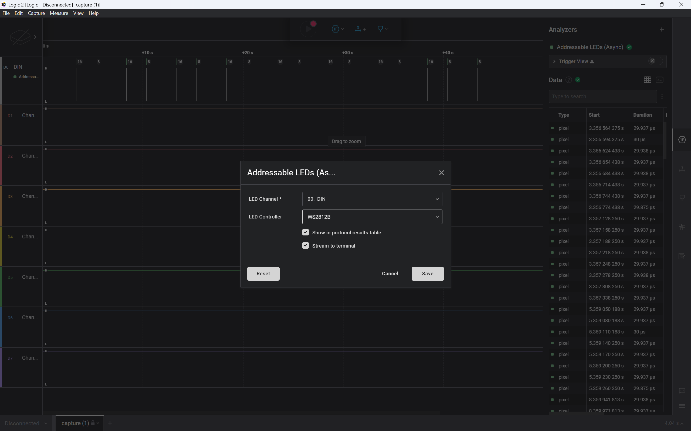

I recently took part in the HACK@AC 2024 CTF (which was objectively easier than Blahaj CTF btw), and I thought I'd do a couple write ups.

## 'Homework' folder

This challenge was classified as a forensics challenge, and the description was as follows:



Let's go ahead and run a `binwalk` on `capture.sal`:

```bash
$ binwalk -e capture.sal

DECIMAL       HEXADECIMAL     DESCRIPTION
----------
0             0x0             Zip archive data, at least v2.0 to extract, name: digital-0.bin
1684          0x694           Zip archive data, at least v2.0 to extract, name: digital-1.bin
4235          0x108B          Zip archive data, at least v2.0 to extract, name: digital-2.bin
12377         0x3059          Zip archive data, at least v2.0 to extract, name: digital-3.bin
13892         0x3644          Zip archive data, at least v2.0 to extract, name: digital-4.bin
15319         0x3BD7          Zip archive data, at least v2.0 to extract, name: digital-7.bin
16746         0x416A          Zip archive data, at least v2.0 to extract, name: digital-5.bin
18173         0x46FD          Zip archive data, at least v2.0 to extract, name: digital-6.bin
19600         0x4C90          Zip archive data, at least v2.0 to extract, name: meta.json
21596         0x545C          End of Zip archive, footer length: 22
```

We `cd` into the `_capture.sal.extracted` directory and we're met with a bunch of `.bin` files. Running a `binwalk` on these `.bin` files yield nothing interesting, so we turn to `strings`:

```bash
$ strings digital-0.bin
<SALEAE>
@A|^:A
Oc:A
I|:A
_HqA
IP:L<2
J':A

$ strings digital-1.bin
<SALEAE>

$ strings digital-2.bin
<SALEAE>
```

After running it a couple times, we can see that each `.bin` file contains the string `<SALEAE>`. A quick google search tells us that this is the header for a Saleae Logic Analyzer file, so let's go ahead and download the Logic 2 analyzer they have kindly provided us with ([link](https://www.saleae.com/downloads/)).

After downloading it, we open `capture.sal` and we're met with the following:



After filtering through the user manual for a good 30 minutes or so, we discover that the SPI Analyzer can be used to analyze the MISO and MOSI signals. let's go ahead and add the SPI Analyzer:



Now we just need to search for the flag. My dumbass spent a good afternoon trying to manually find to flag until I realised I could have just gone to the data tab on the right and searched for a open brace (`{`).

...And yeah, that's pretty much it. That's the flag.

`ACSI{d1d_y0u_r34d_th3_SD_SPI_sp3c5?}`

~speedran this during chinese so do expect some grammatical errors~

## Twinkle Twinkle

Twinkle Twinkle is likewise a forensics question consisting of a Saleae Capture File. Let's load it into Logic:



Since the challenge mentions Neopixel (WS2812) LED lights, we can use the "Addressable LED" analyzer and choose "WS2812B" for the LED Controller.



The challenge also comes with a markdown file describing the data transfer protocol. Here's the abridged version:

1. A new packet starts with LED 0 displaying solid white for 2 seconds while the rest are off.
2. After 2 seconds, LED 0 is set to either Red, Green, or Blue, indicating the data channel for the current packet.
3. Hex data is encoded into the color intensities on LEDs 1-7. The chosen channel carries the actual data, and the other two channels are set to random intensities. Each LED from 1-7 represents one byte of hex data, encoding a total of 7 bytes per

After analyzing the data, we discover that each packet contains 24 rows, with the useful data only being shown in the last 8 rows. The first data transmission occurs at roughly around the 5s mark, with the green LED lighting up. Following the `0xFF` of the first row are 7 other hex numbers, each representing a character in the flag.

Below is the data for the first transmission:

| name                     | type  | start_time | duration    | index | red  | green | blue |
| ------------------------ | ----- | ---------- | ----------- | ----- | ---- | ----- | ---- |
| Addressable LEDs (Async) | pixel | 5.35905019 | 2.99375e-05 | 0x00  | 0x00 | 0xFF  | 0x00 |
| Addressable LEDs (Async) | pixel | 5.35908019 | 2.99375e-05 | 0x01  | 0x13 | 0x41  | 0x9E |
| Addressable LEDs (Async) | pixel | 5.35911019 | 3e-05       | 0x02  | 0x26 | 0x43  | 0xAF |
| Addressable LEDs (Async) | pixel | 5.35914025 | 2.99375e-05 | 0x03  | 0xC5 | 0x53  | 0x72 |
| Addressable LEDs (Async) | pixel | 5.35917025 | 2.99375e-05 | 0x04  | 0x44 | 0x49  | 0xBC |
| Addressable LEDs (Async) | pixel | 5.35920025 | 2.99375e-05 | 0x05  | 0x6D | 0x7B  | 0x78 |
| Addressable LEDs (Async) | pixel | 5.35923025 | 2.99375e-05 | 0x06  | 0x50 | 0x6E  | 0x66 |
| Addressable LEDs (Async) | pixel | 5.35926025 | 2.9875e-05  | 0x07  | 0x2F | 0x30  | 0x66 |

Let's extract the data from the green LED and convert it to ASCII:

```
0x41
0x43
0x53
0x49
0x7B
0x6E
0x30
```

This converts to `ACSI{n0`, which means we're probably on the right track. Let's continue:

| name                     | type  | start_time | duration    | index | red  | green | blue |
| ------------------------ | ----- | ---------- | ----------- | ----- | ---- | ----- | ---- |
| Addressable LEDs (Async) | pixel | 10.3624004 | 2.99375e-05 | 0x00  | 0x00 | 0x00  | 0xFF |
| Addressable LEDs (Async) | pixel | 10.3624304 | 2.99375e-05 | 0x01  | 0x8E | 0x4F  | 0x74 |
| Addressable LEDs (Async) | pixel | 10.3624604 | 2.99375e-05 | 0x02  | 0xA0 | 0x34  | 0x5F |
| Addressable LEDs (Async) | pixel | 10.3624904 | 2.99375e-05 | 0x03  | 0x03 | 0x7C  | 0x76 |
| Addressable LEDs (Async) | pixel | 10.3625204 | 2.99375e-05 | 0x04  | 0x72 | 0x20  | 0x33 |
| Addressable LEDs (Async) | pixel | 10.3625504 | 2.99375e-05 | 0x05  | 0x46 | 0x12  | 0x72 |
| Addressable LEDs (Async) | pixel | 10.3625804 | 3e-05       | 0x06  | 0xBD | 0x7B  | 0x79 |
| Addressable LEDs (Async) | pixel | 10.3626105 | 3e-05       | 0x07  | 0x74 | 0xBE  | 0x79 |

Let's extract the data from the blue LED:

```
0x74
0x5F
0x76
0x33
0x72
0x79
0x79
```

This converts to `t_v3ryy`.

Let's do it for the next transmission:

| name                     | type  | start_time | duration    | index | red  | green | blue |
| ------------------------ | ----- | ---------- | ----------- | ----- | ---- | ----- | ---- |
| Addressable LEDs (Async) | pixel | 15.3657717 | 2.99375e-05 | 0x00  | 0x00 | 0xFF  | 0x00 |
| Addressable LEDs (Async) | pixel | 15.3658017 | 2.99375e-05 | 0x01  | 0x38 | 0x79  | 0x11 |
| Addressable LEDs (Async) | pixel | 15.3658317 | 2.99375e-05 | 0x02  | 0x9D | 0x5F  | 0xE6 |
| Addressable LEDs (Async) | pixel | 15.3658617 | 2.99375e-05 | 0x03  | 0x03 | 0x73  | 0x8B |
| Addressable LEDs (Async) | pixel | 15.3658917 | 2.99375e-05 | 0x04  | 0x4F | 0x33  | 0xCC |
| Addressable LEDs (Async) | pixel | 15.3659217 | 2.99375e-05 | 0x05  | 0x42 | 0x63  | 0x16 |
| Addressable LEDs (Async) | pixel | 15.3659517 | 2.99375e-05 | 0x06  | 0xA7 | 0x75  | 0xD0 |
| Addressable LEDs (Async) | pixel | 15.3659817 | 3e-05       | 0x07  | 0x8D | 0x72  | 0x9B |

The data from this converts to `y_s3cur`.

After doing the same for the next few transmissions, we get the following:

```
0x33
0x33
0x5f
0x6d
0x33
0x73
0x73
0x61
0x67
0x31
0x6E
0x67
0x5F
0x35
0x79
0x35
0x74
0x33
0x6D
0x5F
0x66
0x64
0x62
0x38
0x63
0x61
0x32
0x36
0x7d
```

This converts to `33_m3ssag1ng_5y5t3m_fdb8ca26}`. After assembling the flag, we get `ACSI{n0t_v3ryyy_s3cur33_m3ssag1ng_5y5t3m_fdb8ca26}`.
